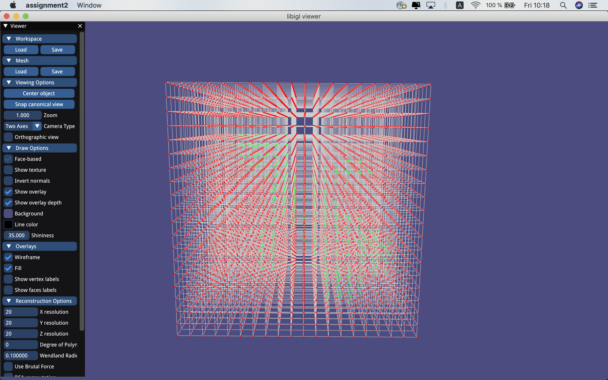
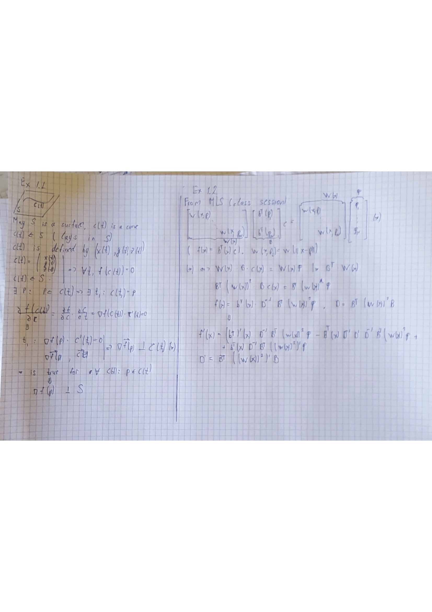

# Assignment 2
<<<<<<< HEAD
Daniil Emtsev ETH Zurich

=======

Edit this 'README.md' file to report all your results. There is no need to write lengthy reports, just show the requested outputs and screenshots and quickly summarize your observations. Please add your additional files or notes in the folder 'assignment2/results' and refer to or directly show them in this page.
>>>>>>> 66a8c78257da8ab818e78717e519cb108ab781c6

## Required results

### Coding Tasks
1) Show the visualization of the constrained points for the 'cat.off' point cloud.

<<<<<<< HEAD
Constraint points:

2) Show screenshots of the (non-axis-aligned) grid with nodes colored according to their implicit function values (cat.off and luigi.off).

Grid:

3) Show screenshots of the reconstructed surfaces. Experiment with different parameter settings: grid resolution (also anisotropic in the 3 axes), Wendland function radius, polynomial degree. Add all these settings to the GUI to ease experimentation. Briefly summarize your observations and save the reconstructed models in the off format for every point-cloud dataset provided (assignment2/results).

Mesh:

I have experimented with resolution, polynomial degree and Wendland function radious. Bigger resolution leads to more subtle details reconstruction and takes more time to compute. I use 20 eventually. The bigger the polynomial degree (0, 1, 2) leads to more artifacts and takes more time to compute. Bigger Wendland function radious leads to more smooth reconstruction with less artifacts since every time locally we take more points to calculate coefficients for approximating function. Finally I used 0.1. 

Polynomial degree 0, Wendland radious 0.1

Polynomial degree 1, Wendland radious 0.1

Polynomial degree 2, Wendland radious 0.1

Polynomial degree 0, Wendland radious 0.3

Polynomial degree 1, Wendland radious 0.3

Polynomial degree 2, Wendland radious 0.3

4) Show the computation time using the spatial index VS. using the brute-force loop.

Brute force computation takes longer to compute rather than query data structure (1.3 sec versus 0.9 sec) for Bunny 500 20 res, wendland 0.1, pol degree 0.

=======
2) Show screenshots of the (non-axis-aligned) grid with nodes colored according to their implicit function values (cat.off and luigi.off).

3) Show screenshots of the reconstructed surfaces. Experiment with different parameter settings: grid resolution (also anisotropic in the 3 axes), Wendland function radius, polynomial degree. Add all these settings to the GUI to ease experimentation. Briefly summarize your observations and save the reconstructed models in the off format for every point-cloud dataset provided (assignment2/results).

4) Show the computation time using the spatial index VS. using the brute-force loop.

>>>>>>> 66a8c78257da8ab818e78717e519cb108ab781c6

### Additonal Tasks: 

(1) and (2) Save your notes (pdf or png) and add a link to this page.

<<<<<<< HEAD

(3) Show screenshots comparing the 'hound.off' of the normal based reconstruction to the point based reconstruction of the mandatory task.

Without norm:

Subtle features like arms are better with the normal constraint
(4) Show screenshots comparing your MLS reconstruction results to the surfaces obtained with Screened Poisson Reconstruction and RIMLS, and explain their main differences to your MLS. Report your findings.

(5) Show screenshots comparing the PCA normals and the provided normals on the 'luigi.off' model. Report your findings.

PCA luigi

Wihtout PCA luigi

I found out that the reconstruction by PCA preserves details better, body parts are more separated, corners are more outlined. Conservative gives more smooth results.
=======
(3) Show screenshots comparing the 'hound.off' of the normal based reconstruction to the point based reconstruction of the mandatory task.

(4) Show screenshots comparing your MLS reconstruction results to the surfaces obtained with Screened Poisson Reconstruction and RIMLS, and explain their main differences to your MLS. Report your findings.

(5) Show screenshots comparing the PCA normals and the provided normals on the 'luigi.off' model. Report your findings.
>>>>>>> 66a8c78257da8ab818e78717e519cb108ab781c6
